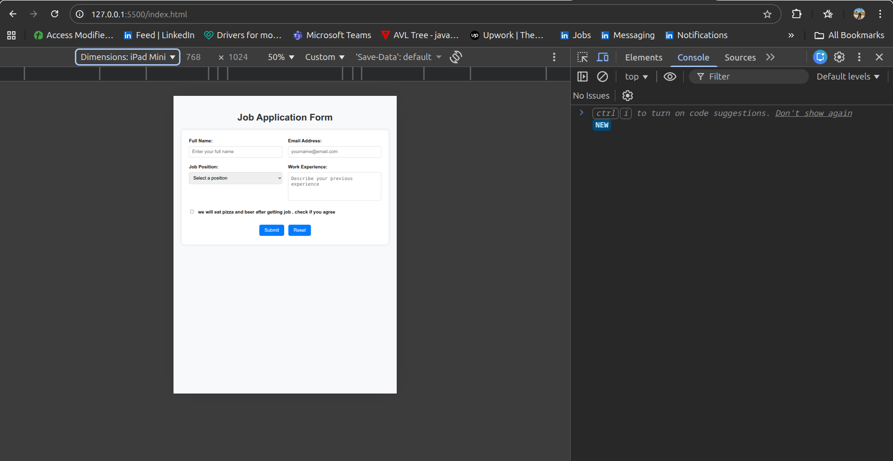
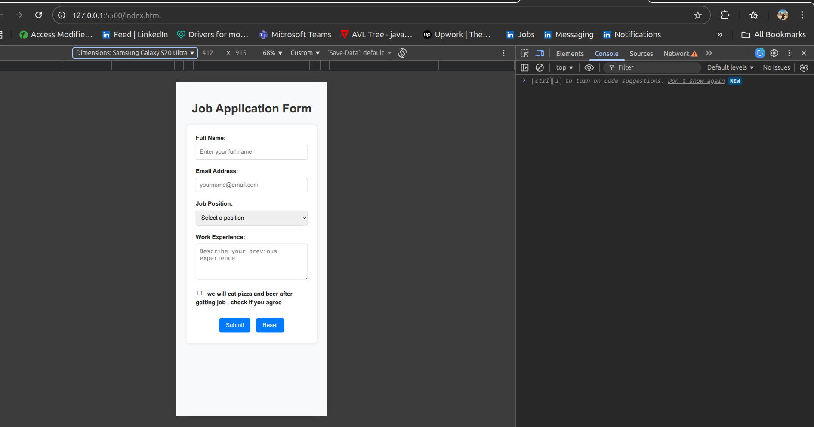
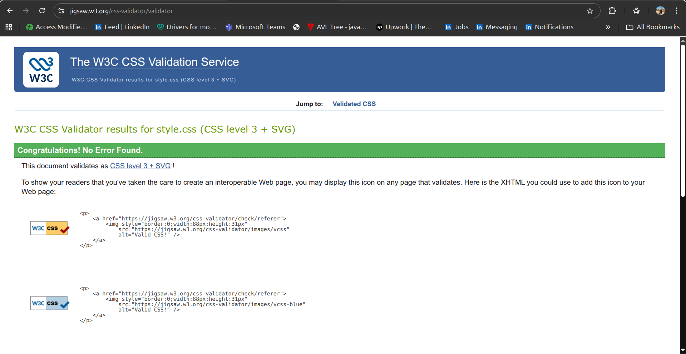
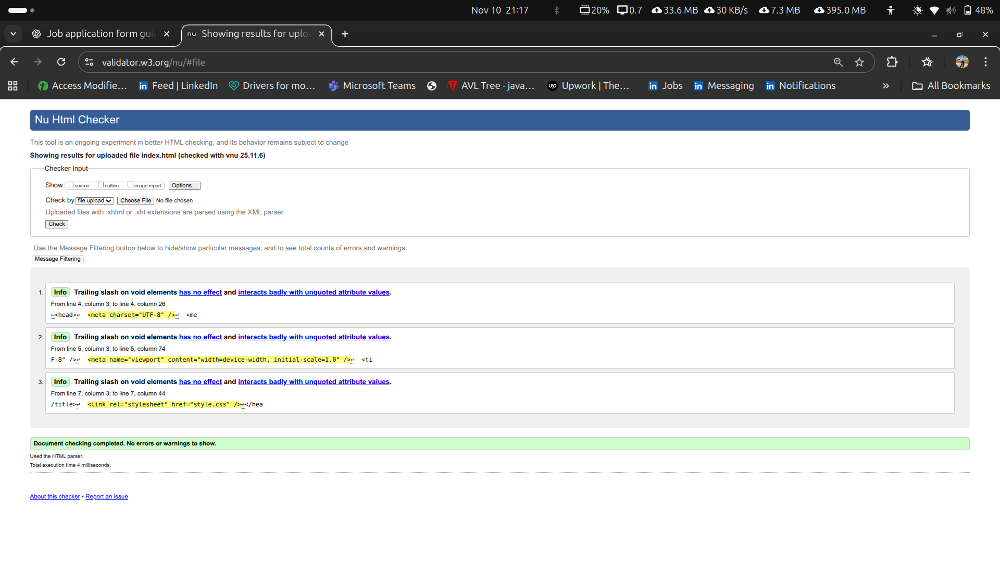

# Job Application Form – Report

## 🧭 Overview
This project is a responsive job application form created with pure HTML and CSS Grid.  
It changes layout depending on screen size:
- **Under 600px** → single-column (mobile)
- **Over 600px** → two-column (desktop)

Form action:
<Form action="https://postman-echo.com/post" method="post"></form>

